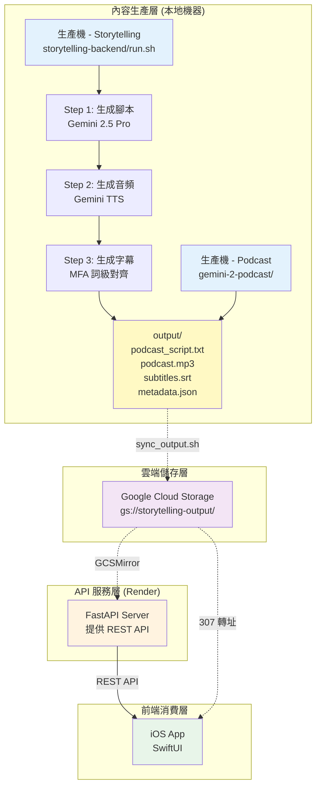
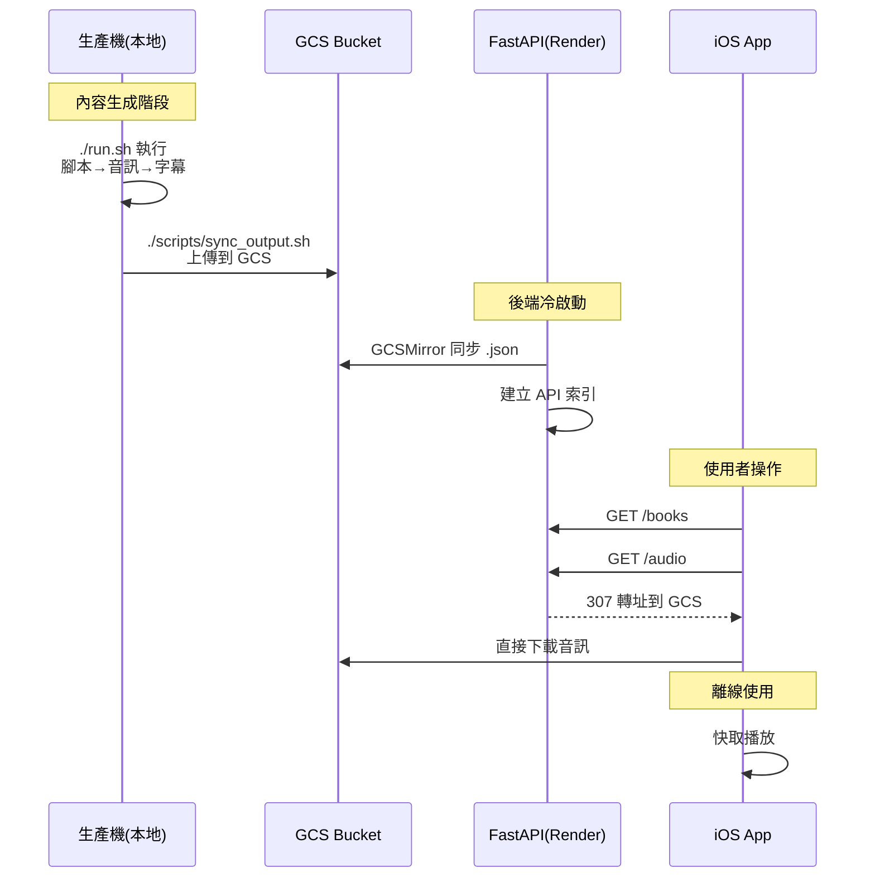

# Podcast Workspace

> 整合式 AI 播客學習平台 Monorepo - 從內容生成到行動播放的完整解決方案

[](https://www.python.org/downloads/)
[](https://swift.org/)
[](https://fastapi.tiangolo.com/)
[](https://www.apple.com/ios/)

## 🎯 專案總覽

此 Monorepo 包含三個緊密整合的子專案，共同組成完整的 AI 播客學習平台：

| 子專案 | 技術棧 | 角色 | 快速入口 |
| --- | --- | --- | --- |
| [storytelling-backend/](storytelling-backend/) | Python 3.12+, FastAPI, Gemini 2.5, MFA | 🏭 **內容生成引擎** + REST API | [後端 README](storytelling-backend/README.md) |
| [audio-earning-ios/](audio-earning-ios/) | Swift 5.9+, SwiftUI, AVFoundation | 📱 **iOS 播放器** - 沉浸式學習體驗 | [前端 README](audio-earning-ios/README.md) |
| [gemini-2-podcast/](gemini-2-podcast/) | Python, Gemini Multi-Speaker TTS | 🎙️ **對話式播客生成器** | [Podcast README](gemini-2-podcast/README.md) |

---

## 📊 系統架構



> 💡 **完整架構圖**：[docs/diagrams/full-architecture.mmd](docs/diagrams/full-architecture.mmd)
> 📊 **資料流程圖**：[workflow.mmd](workflow.mmd)

---

## 🚀 快速開始

### 前置需求

- **Python 3.12+** (後端)
- **Node.js 18+** (工具)
- **Xcode 15+** (iOS 開發)
- **Google Gemini API Key**
- **Google Cloud 帳號** (GCS 儲存)

### 1. 克隆倉庫

```bash
git clone https://github.com/MaxChen228/podcast-workspace.git
cd podcast-workspace
```

### 2. 後端設置（內容生成 + API）

```bash
cd storytelling-backend

# 創建虛擬環境
python3 -m venv .venv
source .venv/bin/activate

# 安裝依賴
pip install -r requirements/base.txt

# 配置環境變數
cp .env.example .env
# 編輯 .env 添加 GEMINI_API_KEY

# 生成內容（互動式 CLI）
./run.sh

# 或啟動 API 服務
uvicorn server.app.main:app --reload --host 0.0.0.0 --port 8000
```

**產出位置：** `storytelling-backend/output/<book>/<chapter>/`

### 3. iOS App 設置

```bash
cd audio-earning-ios
open audio-earning.xcodeproj  # Xcode 15+
```

1. 在 App 設定頁配置後端 API URL
2. 選擇模擬器或實機
3. 執行 (⌘R)

### 4. Gemini 對話式播客（可選）

```bash
cd gemini-2-podcast
pip install -r requirements.txt
python generate_podcast.py --language spanish
```

---

## 🔄 工作流程



---

## 📁 專案結構

```
podcast-workspace/                 # Monorepo 根目錄
├── README.md                      # 本文件
├── .gitignore                     # 統一 Git 忽略規則
├── docs/                          # 共用文檔
│   └── diagrams/                  # 複雜 Mermaid 圖表
│       └── full-architecture.mmd  # 完整架構圖
├── storytelling-backend/          # 後端內容生成 + API
│   ├── run.sh                     # CLI 主入口
│   ├── server/app/main.py         # FastAPI 應用
│   ├── generate_script.py         # 腳本生成器
│   ├── generate_audio.py          # 音頻生成器
│   ├── generate_subtitles.py      # 字幕生成器
│   ├── output/                    # 生成結果
│   ├── data/                      # 書籍源文件
│   └── docs/                      # 後端文檔
├── audio-earning-ios/             # iOS 前端 App
│   ├── audio-earning/             # SwiftUI 源碼
│   │   ├── Views/                 # UI 元件
│   │   ├── ViewModels/            # MVVM 狀態管理
│   │   ├── Services/              # API, 快取, 備份
│   │   └── Utilities/             # 工具函式
│   └── docs/                      # iOS 文檔
├── gemini-2-podcast/              # 對話式播客生成器
│   ├── generate_podcast.py        # 主程式
│   └── README.md                  # 使用說明
└── scripts/                       # 跨專案腳本
    └── convert_wav_to_mp3.py      # 音訊轉換工具
```

---

## 🎓 核心功能

### 🏭 內容生成（storytelling-backend）

- ✅ **AI 腳本生成** - Gemini 2.5 Pro 將書籍章節轉換為教學風格播客
- ✅ **高品質 TTS** - Gemini Multi-Speaker TTS 生成自然流暢音頻
- ✅ **詞級字幕對齊** - Montreal Forced Aligner 實現毫秒級精準同步
- ✅ **多語言等級** - 支援 6 個英語程度 (A2-C1 CEFR)
- ✅ **批次處理** - 並行生成多個章節，提升效率

### 📱 iOS 播放器（audio-earning-ios）

- ✅ **書籍/章節瀏覽** - 支援離線快照、批次下載、6 小時快取 TTL
- ✅ **沉浸式播放器** - AVPlayer + 波形視覺化、進度追蹤自動儲存
- ✅ **字幕與翻譯** - 詞級高亮、逐句翻譯、句子/片語解釋、詞彙收藏
- ✅ **資料備份** - JSON 匯出/匯入，包含進度、設定、詞彙

### 🎙️ 對話式播客（gemini-2-podcast）

- ✅ **多人對話生成** - Gemini Multi-Speaker TTS 生成自然對話
- ✅ **多語言支援** - 支援 Spanish, French, German 等多種語言
- ✅ **無縫整合** - 可匯入主系統作為特殊章節

---

## 🛠 技術棧

| 層級 | 技術 | 用途 |
|------|------|------|
| **AI/ML** | Gemini 2.5 Pro, Gemini TTS | 腳本生成、語音合成 |
| **音訊處理** | Montreal Forced Aligner, pydub | 字幕對齊、音訊轉換 |
| **後端** | FastAPI, Uvicorn, Pydantic | REST API 服務 |
| **儲存** | Google Cloud Storage (GCS) | 媒體檔案儲存 |
| **部署** | Render.com, Docker | 雲端部署 |
| **前端** | SwiftUI, Combine, AVFoundation | iOS 原生應用 |
| **架構** | MVVM, Dependency Injection | 前端架構模式 |

---

## 📖 文檔導航

### 新手入門
- [後端安裝指南](storytelling-backend/docs/setup/installation.md)
- [後端配置說明](storytelling-backend/docs/setup/configuration.md)
- [iOS 快速開始](audio-earning-ios/QUICKSTART.md)

### 開發者
- [系統架構](storytelling-backend/docs/development/architecture.md)
- [iOS 架構設計](audio-earning-ios/docs/architecture.md)
- [API 參考文檔](storytelling-backend/docs/api/reference.md)

### 運維人員
- [Render 部署指南](storytelling-backend/DEPLOY_RENDER.md)
- [故障排除](storytelling-backend/docs/operations/troubleshooting.md)

---

## 🔧 常用命令

```bash
# 後端：生成內容
cd storytelling-backend
./run.sh                              # 互動式 CLI
./run.sh && uvicorn server.app.main:app --reload  # 生成後啟動 API

# 後端：部署到 Render
git push origin main                  # 自動觸發部署

# 後端：同步到 GCS
./scripts/sync_output.sh

# iOS：清除快取
# App 內設定頁 → Clear Cache

# 查看 Git 狀態
git status
git log --oneline --graph --all
```

---

## 🌟 特色亮點

1. **Monorepo 架構** - 統一版本管理，簡化協作
2. **AI 驅動生成** - Gemini 2.5 Pro + TTS 生成高品質內容
3. **詞級精準字幕** - MFA 對齊，避免估算漂移
4. **完整離線支援** - iOS App 批次下載，完全離線播放
5. **智慧快取策略** - 多層快取，最佳化使用者體驗
6. **靈活部署** - Render 一鍵部署，GCS 媒體儲存

---

## 🤝 貢獻指南

1. Fork 此倉庫
2. 創建功能分支：`git checkout -b feature/amazing-feature`
3. 提交變更：`git commit -m 'feat: add amazing feature'`
4. 推送分支：`git push origin feature/amazing-feature`
5. 開啟 Pull Request

---

## 📝 Git Remote 備份

原始倉庫 URL 已備份至：
- `git-remote-backend.txt` - storytelling-backend 倉庫
- `git-remote-ios.txt` - audio-earning-ios 倉庫
- `git-remote-podcast.txt` - gemini-2-podcast 倉庫

---

## 📄 授權

MIT License

---

## 💡 需要幫助？

- 📖 [完整文檔](docs/)
- 🐛 [報告問題](https://github.com/MaxChen228/podcast-workspace/issues)
- 💬 [討論區](https://github.com/MaxChen228/podcast-workspace/discussions)

---

**Built with ❤️ using Gemini AI, FastAPI, and SwiftUI**
