# Podcast Workspace

> 整合式 AI 播客學習平台 Monorepo - 從內容生成到行動播放的完整解決方案

[](https://www.python.org/downloads/)
[](https://swift.org/)
[](https://fastapi.tiangolo.com/)
[](https://www.apple.com/ios/)

## 🎯 專案總覽

此 Monorepo 包含四個緊密整合的子專案，共同組成完整的 AI 播客學習平台：

| 子專案 | 技術棧 | 角色 | 快速入口 |
| --- | --- | --- | --- |
| [storytelling-cli/](storytelling-cli/) | Python 3.12+, Gemini 2.5, MFA | 🏭 **CLI 內容生產工具** - 腳本/音訊/字幕生成 | [CLI README](storytelling-cli/README.md) |
| [backend/](backend/) | Python 3.12+, FastAPI, GCS | 🌐 **REST API 服務** - 提供內容 API | [後端 README](backend/README.md) |
| [audio-earning-ios/](audio-earning-ios/) | Swift 5.9+, SwiftUI, AVFoundation | 📱 **iOS 播放器** - 沉浸式學習體驗 | [前端 README](audio-earning-ios/README.md) |
| [gemini-2-podcast/](gemini-2-podcast/) | Python, Gemini Multi-Speaker TTS | 🎙️ **對話式播客生成器** | [Podcast README](gemini-2-podcast/README.md) |

**共享目錄：**
- `data/` - 書籍源文件、transcripts
- `output/` - 生成的播客內容（腳本、音訊、字幕）

---

## 📊 系統架構

```mermaid
graph TB
    subgraph "內容生產層 (本地機器/Worker)"
        A1[CLI 工具<br/>storytelling-cli/run.sh]
        A2[對話生成器<br/>gemini-2-podcast/]

        A1_1[Step 1: 生成腳本<br/>Gemini 2.5 Pro]
        A1_2[Step 2: 生成音頻<br/>Gemini TTS]
        A1_3[Step 3: 生成字幕<br/>MFA 詞級對齊]

        A1 --> A1_1 --> A1_2 --> A1_3
        OUTPUT[共享輸出目錄<br/>output/<br/>podcast_script.txt<br/>podcast.mp3<br/>subtitles.srt<br/>metadata.json]
        A1_3 --> OUTPUT
        A2 --> OUTPUT
    end

    subgraph "雲端儲存層"
        GCS[Google Cloud Storage<br/>gs://storytelling-output/]
    end

    subgraph "API / 任務層 (Render)"
        B[FastAPI Server<br/>backend/<br/>提供 REST API + PodcastJob]
        Q[Redis Queue<br/>podcast-job-queue]
        W[Podcast Job Worker<br/>python -m server.app.workers.podcast_job_worker<br/>（本地或雲端）]
        B -->|POST /podcasts/jobs| Q
        W -->|BLPOP| Q
        W --> OUTPUT
    end

    subgraph "前端消費層"
        C[iOS App<br/>SwiftUI]
    end

    OUTPUT -.->|scripts/sync_output.sh| GCS
    GCS -.->|GCSMirror| B
    B -->|REST API + 任務查詢| C
    GCS -.->|307 轉址| C

    style A1 fill:#e3f2fd
    style A2 fill:#e3f2fd
    style OUTPUT fill:#fff9c4
    style GCS fill:#f3e5f5
    style B fill:#fff3e0
    style Q fill:#f8bbd0
    style W fill:#e1bee7
    style C fill:#e8f5e9
```



> 💡 **完整架構圖**：[docs/diagrams/full-architecture.mmd](docs/diagrams/full-architecture.mmd)
> 📊 **資料流程圖**：[workflow.mmd](workflow.mmd)

---

## 🚀 快速開始

### 前置需求

- **Python 3.12+** (後端)
- **Node.js 18+** (工具)
- **Xcode 15+** (iOS 開發)
- **Google Gemini API Key**
- **Google Cloud 帳號** (GCS 儲存)

### 1. 克隆倉庫

```bash
git clone https://github.com/MaxChen228/podcast-workspace.git
cd podcast-workspace
```

### 2. CLI 設置（內容生成）

```bash
cd storytelling-cli

# 創建虛擬環境
python3 -m venv .venv
source .venv/bin/activate

# 安裝依賴
pip install -r requirements.txt

# 配置環境變數
cp .env.example .env
# 編輯 .env 添加 GEMINI_API_KEY

# 生成內容（互動式 CLI）
./run.sh
```

**產出位置：** `output/<book>/<chapter>/`

### 3. API 服務設置（選填）

```bash
cd backend

# 創建虛擬環境（如果還沒有）
python3 -m venv .venv
source .venv/bin/activate

# 安裝 API 依賴
pip install -r requirements/server.txt

# 配置環境變數
cp .env.example .env
# 編輯 .env 添加 GEMINI_API_KEY 和 GCS 設定

# 啟動 API 服務
uvicorn server.app.main:app --reload --host 0.0.0.0 --port 8000
```

### 4. iOS App 設置

```bash
cd audio-earning-ios
open audio-earning.xcodeproj  # Xcode 15+
```

1. 在 App 設定頁配置後端 API URL
2. 選擇模擬器或實機
3. 執行 (⌘R)

### 5. Gemini 對話式播客（可選）

```bash
cd gemini-2-podcast
pip install -r requirements.txt
python generate_podcast.py --language spanish
```

## 🧵 API 觸發內容生成 (Render + 本地 Worker)

1. **部署 Web API**：`backend/` 以 Render Web Service 執行，環境變數需包含 `DATABASE_URL`（Postgres）、`QUEUE_URL`（Redis/KeyValue）、`PODCAST_JOB_QUEUE_NAME`、`GEMINI_API_KEY` 等。
2. **啟動 Podcast Job Worker**：在 monorepo 根目錄，建立 `backend/.env`，至少設定
   - `PROJECT_ROOT=/path/to/podcast-workspace`
   - `DATABASE_URL`（Render Postgres external URL）
   - `QUEUE_URL`（Redis external URL）
   - `PODCAST_JOB_QUEUE_NAME=podcast_jobs`
   - `OUTPUT_ROOT`、`DATA_ROOT` 指向共享 `output/`

   然後執行：

   ```bash
   cd backend
   source .venv/bin/activate
   export $(grep -v '^#' .env | xargs)
   python -m server.app.workers.podcast_job_worker
   ```

   Worker 會從 Redis 佇列取出 `PodcastJob`，呼叫 `gemini-2-podcast` 生成腳本/音訊，再透過 `storytelling-cli/scripts/import_gemini_dialogue.py` 匯入 `output/<book>/<chapter>/`。
3. **觸發任務**：對 Render API 呼叫 `POST /podcasts/jobs` 並附上來源、書籍/章節、語言、`create_book` 等參數。使用 `GET /podcasts/jobs/{id}` 追蹤狀態；當 `status=succeeded` 時，iOS 端即可即時讀取該章節。

---

## 🔄 工作流程

```mermaid
sequenceDiagram
    participant P as 生產機(本地)
    participant G as GCS Bucket
    participant API as FastAPI(Render)
    participant iOS as iOS App

    Note over P: 內容生成階段
    P->>P: ./run.sh 執行<br/>腳本→音訊→字幕

    P->>G: ./scripts/sync_output.sh<br/>上傳到 GCS

    Note over API: 後端冷啟動
    API->>G: GCSMirror 同步 .json
    API->>API: 建立 API 索引

    Note over iOS: 使用者操作
    iOS->>API: GET /books
    iOS->>API: GET /books/{book}/chapters
    iOS->>API: GET /books/{book}/chapters/{chapter}
    API-->>iOS: ChapterPlayback(JSON，含 audio_url/subtitles_url)
    iOS->>API: GET /books/{book}/chapters/{chapter}/audio
    API-->>iOS: 200 streaming 或 307 → GCS（依 media_delivery_mode）
    iOS->>G: 若被轉址則直接下載音訊/字幕

    Note over iOS: 離線使用
    iOS->>iOS: 快取播放
```



## 📁 專案結構

```
podcast-workspace/                 # Monorepo 根目錄
├── README.md                      # 本文件
├── .gitignore                     # 統一 Git 忽略規則
├── docs/                          # 共用文檔
│   └── diagrams/                  # 複雜 Mermaid 圖表
│       └── full-architecture.mmd  # 完整架構圖
│
├── storytelling-cli/              # 🆕 CLI 內容生產工具
│   ├── run.sh                     # CLI 主入口
│   ├── generate_script.py         # 腳本生成器
│   ├── generate_audio.py          # 音頻生成器
│   ├── generate_subtitles.py      # 字幕生成器
│   ├── cli/                       # CLI 實現
│   ├── alignment/                 # MFA 對齊工具
│   ├── scripts/                   # 輔助腳本
│   ├── requirements/              # CLI 依賴
│   │   ├── cli.txt               # CLI 專屬依賴
│   │   ├── base.txt              # 基礎依賴
│   │   └── core.txt              # 核心依賴
│   └── README.md                  # CLI 文檔
│
├── backend/                       # FastAPI REST API 服務
│   ├── server/app/main.py         # FastAPI 應用
│   ├── requirements/              # API 依賴
│   │   └── server.txt            # 精簡的 API 依賴（不含 CLI 套件）
│   ├── tests/                     # API 測試
│   ├── Dockerfile                 # API 部署映像（精簡版）
│   └── docs/                      # 後端文檔
│
├── data/                          # 🆕 共享資料目錄
│   ├── Foundation/                # 書籍章節源文件
│   ├── Project Hail Mary/
│   ├── Mistborn.../
│   └── transcripts/               # 轉錄文本
│
├── output/                        # 🆕 共享輸出目錄
│   ├── Foundation/                # 生成的播客內容
│   │   └── chapter0/
│   │       ├── podcast_script.txt
│   │       ├── podcast.mp3
│   │       ├── subtitles.srt
│   │       └── metadata.json
│   └── ...
│
├── audio-earning-ios/             # iOS 前端 App
│   ├── audio-earning/             # SwiftUI 源碼
│   │   ├── Views/                 # UI 元件
│   │   ├── ViewModels/            # MVVM 狀態管理
│   │   ├── Services/              # API, 快取, 備份
│   │   └── Utilities/             # 工具函式
│   └── docs/                      # iOS 文檔
│
├── gemini-2-podcast/              # 對話式播客生成器
│   ├── generate_podcast.py        # 主程式
│   └── README.md                  # 使用說明
│
└── scripts/                       # 跨專案腳本
    ├── sync_output.sh             # GCS 同步腳本
    └── convert_wav_to_mp3.py      # 音訊轉換工具
```

---

## 🎓 核心功能

### 🏭 內容生成（storytelling-cli）

- ✅ **AI 腳本生成** - Gemini 2.5 Pro 將書籍章節轉換為教學風格播客
- ✅ **高品質 TTS** - Gemini Multi-Speaker TTS 生成自然流暢音頻
- ✅ **詞級字幕對齊** - Montreal Forced Aligner 實現毫秒級精準同步
- ✅ **多語言等級** - 支援 6 個英語程度 (A2-C1 CEFR)
- ✅ **批次處理** - 並行生成多個章節，提升效率

### 📱 iOS 播放器（audio-earning-ios）

- ✅ **書籍/章節瀏覽** - 支援離線快照、批次下載、6 小時快取 TTL
- ✅ **沉浸式播放器** - AVPlayer + 波形視覺化、進度追蹤自動儲存
- ✅ **字幕與翻譯** - 詞級高亮、逐句翻譯、句子/片語解釋、詞彙收藏
- ✅ **資料備份** - JSON 匯出/匯入，包含進度、設定、詞彙

### 🎙️ 對話式播客（gemini-2-podcast）

- ✅ **多人對話生成** - Gemini Multi-Speaker TTS 生成自然對話
- ✅ **多語言支援** - 支援 Spanish, French, German 等多種語言
- ✅ **無縫整合** - 可匯入主系統作為特殊章節

### 🗞️ 智慧新聞牆（NewsData.io）

- ✅ **即開即用** - 設定 `NEWS_FEATURE_ENABLED=1` 及 `NEWSDATA_API_KEY`，即可透過 NewsData.io 提供即時新聞。
- ✅ **分類/搜尋** - 支援多種分類（科技、商業、運動等）與全文搜尋，80+ 種語言支援。
- ✅ **數據累積** - `POST /news/events` 在 Render 上記錄用戶互動，為之後個人化推薦預先蒐集素材。
- ✅ **免費額度** - 每天 200 credits（約 2000 篇文章），無需信用卡即可註冊使用。

#### 啟用條件
- `NEWS_FEATURE_ENABLED=1` 與 `NEWSDATA_API_KEY`（必填）
- 選配：`NEWSDATA_DEFAULT_LANGUAGE`, `NEWSDATA_DEFAULT_COUNTRY`, `NEWS_CATEGORY_WHITELIST`
- 寫入權限的 `NEWS_EVENTS_DIR`（預設 `backend/logs/news_events`）以存放 JSONL 互動紀錄
- Render Secret File：`GOOGLE_APPLICATION_CREDENTIALS=/etc/secrets/gcs-service-account.json`

#### 運作流程
1. iOS App `NewsFeedView` 透過 `NewsService` 發送 `GET /news/headlines` 或 `/news/search`。
2. FastAPI 後端將請求代理到 NewsData.io，套用 market/category 篩選並快取 15 分鐘，減少配額消耗。
3. App 內操作（開啟、分享、收藏）會以 `POST /news/events` 回報，後端 `NewsEventLogger` 會把 enriched payload 寫入 `NEWS_EVENTS_DIR` 供離線分析。
4. 若 Render 或 NewsData.io 發出錯誤，前端會顯示對應提示並提供重新整理。詳見 [新聞閱讀整合指南](docs/news-reading.md)。

---

## 🛠 技術棧

| 層級 | 技術 | 用途 |
|------|------|------|
| **AI/ML** | Gemini 2.5 Pro, Gemini TTS | 腳本生成、語音合成 |
| **音訊處理** | Montreal Forced Aligner, pydub | 字幕對齊、音訊轉換 |
| **後端** | FastAPI, Uvicorn, Pydantic, httpx | REST API 服務、外部新聞整合 |
| **內容來源** | NewsData.io API | 即時新聞聚合、分類/搜尋（80+ 語言）|
| **儲存** | Google Cloud Storage (GCS) | 媒體檔案儲存 |
| **部署** | Render.com, Docker | 雲端部署 |
| **前端** | SwiftUI, Combine, AVFoundation | iOS 原生應用 |
| **架構** | MVVM, Dependency Injection | 前端架構模式 |

---

## 📖 文檔導航

### 新手入門
- [後端安裝指南](backend/docs/setup/installation.md)
- [後端配置說明](backend/docs/setup/configuration.md)
- [iOS 快速開始](audio-earning-ios/QUICKSTART.md)

### 開發者
- [系統架構](backend/docs/development/architecture.md)
- [iOS 架構設計](audio-earning-ios/docs/architecture.md)
- [API 參考文檔](backend/docs/api/reference.md)

### 功能特化
- [新聞閱讀整合指南](docs/news-reading.md)

### 運維人員
- [Render 部署指南](backend/DEPLOY_RENDER.md)
- [故障排除](backend/docs/operations/troubleshooting.md)

---

## 🔧 常用命令

```bash
# CLI：生成內容
cd storytelling-cli
./run.sh                              # 互動式 CLI 生成播客

# API：啟動服務
cd backend
uvicorn server.app.main:app --reload --host 0.0.0.0 --port 8000

# 部署：推送到 Render
git push origin main                  # 自動觸發 API 部署

# 同步：上傳到 GCS
cd podcast-workspace
./scripts/sync_output.sh

# iOS：清除快取
# App 內設定頁 → Clear Cache

# 查看 Git 狀態
git status
git log --oneline --graph --all
```

---

## 🌟 特色亮點

1. **Monorepo 架構** - 統一版本管理，簡化協作
2. **職責分離設計** - CLI 生產工具與 API 服務完全解耦，獨立開發部署
3. **AI 驅動生成** - Gemini 2.5 Pro + TTS 生成高品質內容
4. **詞級精準字幕** - MFA 對齊，避免估算漂移
5. **整合型新聞牆** - 一鍵啟用 NewsData.io API，無需自建爬蟲即可驗證產品假設
6. **智慧快取策略** - 多層快取，最佳化使用者體驗
7. **靈活部署** - Docker 精簡映像，Render 一鍵部署，GCS 媒體儲存

---

## 🤝 貢獻指南

1. Fork 此倉庫
2. 創建功能分支：`git checkout -b feature/amazing-feature`
3. 提交變更：`git commit -m 'feat: add amazing feature'`
4. 推送分支：`git push origin feature/amazing-feature`
5. 開啟 Pull Request

---

## 📄 授權

MIT License

---

## 💡 需要幫助？

- 📖 [完整文檔](docs/)
- 🐛 [報告問題](https://github.com/MaxChen228/podcast-workspace/issues)
- 💬 [討論區](https://github.com/MaxChen228/podcast-workspace/discussions)

---

**Built with ❤️ using Gemini AI, FastAPI, and SwiftUI**
