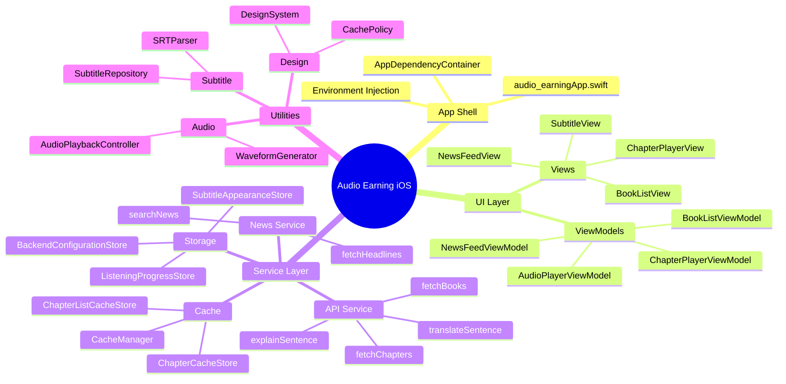
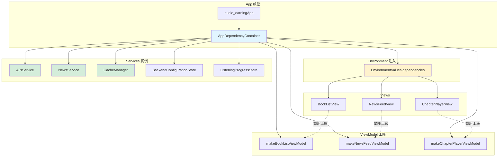
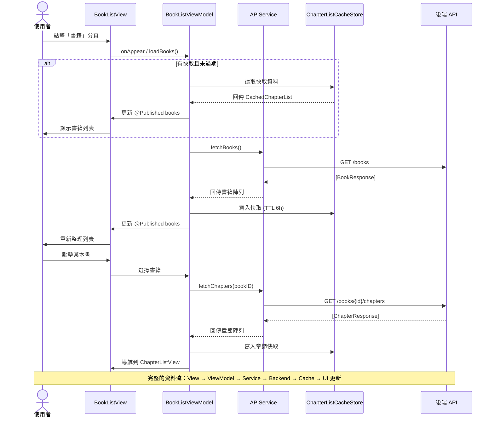
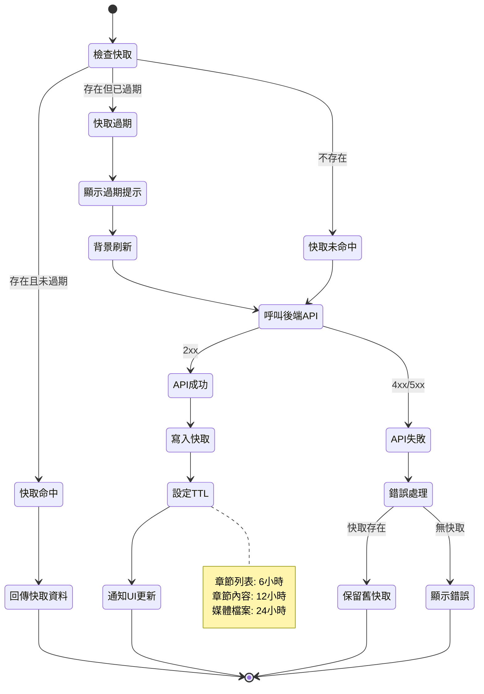

# Architecture Summary

Audio Earning iOS 採用 SwiftUI + MVVM 結合自訂服務層，並透過依賴注入讓 View 與資料來源維持鬆耦合。此文件用 1–2 頁描述整體結構，細節可直接跳至對應程式路徑。

## 整體架構視圖



## 核心層級

| 層級 | 代表檔案 / 目錄 | 角色 |
| --- | --- | --- |
| App Shell | `audio-earning/audio_earningApp.swift`, `Dependency/` | 建立 `AppDependencyContainer`，透過 `EnvironmentValues.dependencies` 提供 ViewModel 工廠。
| Views | `Views/` (如 `BookListView.swift`, `ChapterPlayerView.swift`) | 純 UI 聲明與動作轉發，利用 `@StateObject` / `@ObservedObject` 監聽 ViewModel。|
| ViewModels | `ViewModels/` | 管理狀態、非同步流程、緩存策略；僅與服務層互動。|
| Services & Stores | `Services/` | API 呼叫、快取、備份、設定等資料來源（`APIService`, `BackendConfigurationStore`, `ListeningProgressStore`）。|
| Utilities | `Utilities/` | 共用 helper：`CachePolicy`, `AudioPlaybackController`, `WaveformGenerator` 等。

## 依賴注入



**設計原則**：
- `AppDependencyContainer` 遞給 View 需要的協定（`APIServiceProtocol`, `BackendConfigurationStoring`, `CacheManaging`, `NewsServiceProtocol`）。
- `DependencyEnvironment.swift` 讓任何 SwiftUI View 以 `@Environment(\.dependencies)` 取用，方便預覽／測試注入 stub。
- 服務都以協定對外 (`ServiceProtocols.swift`)，避免直接耦合單例。

## 資料流（閱聽情境）



**關鍵流程**：
1. 使用者在 `BookListView` 點選書籍 → `BookListViewModel` 透過 `APIService.fetchBooks()` 更新狀態。
2. `ChapterListViewModel` 依 `CachePolicy.chapterListTTL` 從 `ChapterListCacheStore` 讀舊資料、並行刷新後端結果，寫回快取再通知 UI。
3. `ChapterPlayerViewModel`／`AudioPlayerViewModel` 取得 `ChapterPlaybackResponse`，交給 `AudioPlaybackController` 管理 `AVPlayer`，並透過 `PlaybackProgressTracker` 與 `ListeningProgressStore` 更新進度。
4. 翻譯／句子解釋流程呼叫 `APIService.translateSentence` / `explainSentence`，結果快取在 ViewModel（已翻資料會標示 `cached`）。

## 播放與字幕管線

```mermaid
graph LR
    subgraph "音頻播放"
        Chapter[ChapterPlayerViewModel]
        Controller[AudioPlaybackController]
        Player[AVPlayer]
        Observer[TimeObserver<br/>0.1秒回報]
    end

    subgraph "字幕同步"
        Parser[SRTParser]
        Repo[SubtitleRepository]
        VM[AudioPlayerViewModel]
        Index[currentSubtitleIndex<br/>O1查找優化]
    end

    subgraph "視覺呈現"
        SubView[SubtitleView]
        WaveView[WaveformView]
        Generator[WaveformGenerator<br/>降採樣500樣本]
    end

    Chapter --> Controller
    Controller --> Player
    Player --> Observer
    Observer --> VM

    Parser --> Repo
    Repo --> VM
    VM --> Index
    Index --> SubView

    Generator --> WaveView

    Observer -.每0.1秒.-> Index
    VM -.同步更新.-> SubView

    style Player fill:#ffebee
    style Observer fill:#fff3e0
    style Index fill:#e8f5e9
    style Generator fill:#e1f5fe
```

**核心機制**：
- `AudioPlaybackController` 控制 `AVPlayer`，加上 `addPeriodicTimeObserver` 每 0.1 秒回報時間。
- `NewsService` + `NewsPreferenceStore` 封裝 `/news/*` 端點與使用者偏好，`NewsFeedViewModel` 透過 Task+async/await 管理快取與互動事件上報。
- `SubtitleRepository` 解析 SRT（`SRTParser`），`AudioPlayerViewModel` 用目前字幕索引避免全表搜尋；若字幕量極大，可切換二分搜尋模式。
- 視覺層由 `SubtitleView` / `SelectableSubtitleTextView` 呈現文字、`WaveformView` 使用 `WaveformGenerator` 降採樣 500 個樣本以 Canvas 繪圖。

## 緩存策略



**快取層級**：
- **Chapter 列表**：`ChapterListCacheStore`，TTL 6 小時 (`CachePolicy.chapterListTTL`)；`ChapterListViewModel` 標記 `showingCachedSnapshot` / `showingStaleCache` 提示使用者。
- **Chapter 細節與媒體**：`ChapterCacheStore` + `APIService` 暫存音訊/字幕檔，TTL 12–24 小時（payload vs media）。`APIService` 將 `gs://` 轉換成公開 HTTPS URL 並保存 ETag，減少重複下載。
- **使用者設定**：`BackendConfigurationStore`, `SubtitleAppearanceStore`, `ListeningProgressStore` 分別儲存伺服器、字幕樣式、進度；`DataExport/ImportService` 可一次備份。

## 擴充點
- 新服務：遵循 `ServiceProtocols.swift` 定義協定，並由 `AppDependencyContainer` 建立實例。
- 新功能：新增 ViewModel & View，盡量保持單一責任，並在 `docs/features.md` 補充簡介。
- 如果需要改變緩存行為，統一修改 `CachePolicy` 以確保文件與程式同步。
